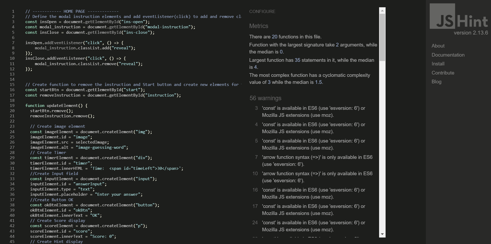
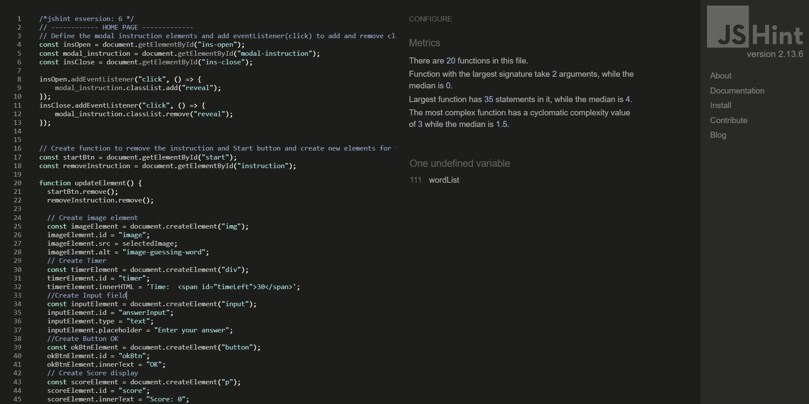
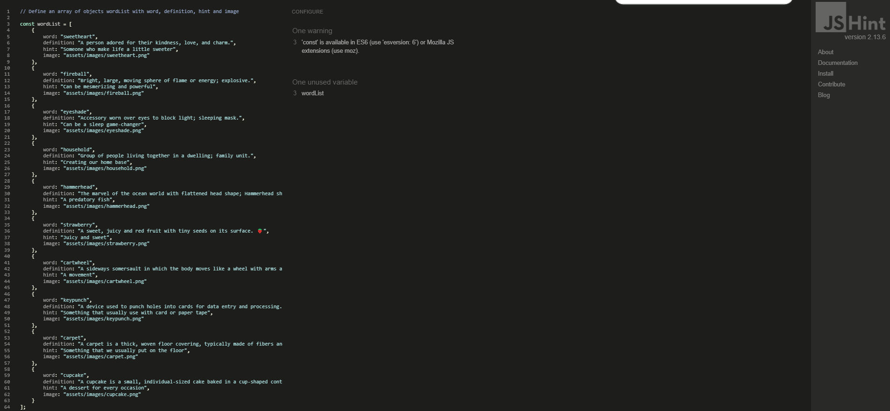
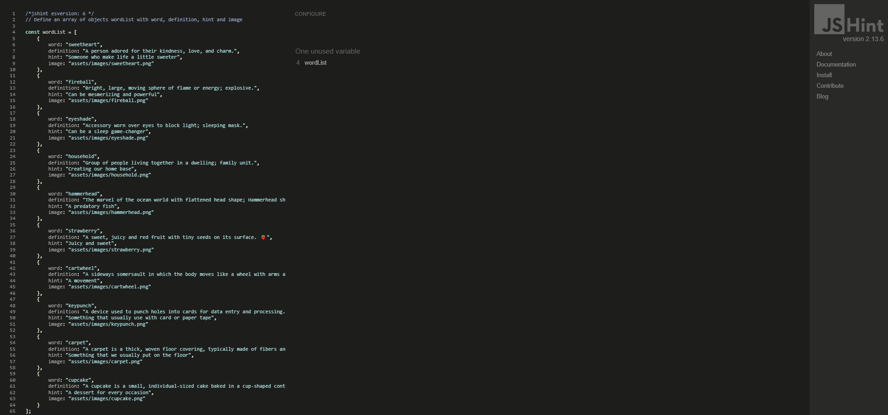

# The Guess Word Game - Testing

## CONTENTS

* [AUTOMATED TESTING](#automated-testing)
  * [HTML](#html)
  * [CSS](#css)
  * [JavaScript Validator](#javascript-validator)
  * [Lighthouse](#lighthouse)
* [MANUAL TESTING](#manual-testing)
  * [Testing User Stories](#testing-user-stories)
  * [Full Testing](#full-testing)

## AUTOMATED TESTING

### HTML 
I used [W3C Markup Validation Service](https://validator.w3.org/) to check and validate the HTML code.

`index.html`
- There are 3 issues that need to be fixed. The first 2 issues are from trailing slash on void element had no effect and intereacted badly with un quoted attribute values. To solve these issues, I removed the unneccesary slash from the elements. The last issue is the document is not mapable to XML 1.0 due to two consecutive hyphens in a comment. To solve this issue, I removed the two consecutive hyphens from the comment. 
 

- After fixing issues, the result of the validation is Passed.

`404.html`
- Passed.

  

### CSS 
I used [W3C CSS Validation Service](https://jigsaw.w3.org/css-validator/) to check and validate the CSS code.

- Passed, no errors found.

### JavaScript Validator

I used [JSHint](https://jshint.com/) to validate the JavaScript code.

`script.js`
- 56 warning about 'const' is available in ES6 and 'arrow function syntax' is only available in ES6. It also stated that 'wordList is undefined variable (This dued to the variable being in a separate js file named wordlist.js)
 

- To improve this, I include a commented out line, /*jshint esversion: 6 */ at the top of the file. The resouce of solution found in [StackOverFlow](https://stackoverflow.com/questions/27441803/why-does-jshint-throw-a-warning-if-i-am-using-const/37472928#37472928)

`wordlist.js`

- A warning about 'const' is available in ES6 same as the script.js above and one unused varible 'wordList' (This dued to the variable be used in a separate js file named script.js)

- To improve this, I include a commented out line, /*jshint esversion: 6 */ at the top of the file. The resouce of solution found in [StackOverFlow](https://stackoverflow.com/questions/27441803/why-does-jshint-throw-a-warning-if-i-am-using-const/37472928#37472928)

### Lighthouse

I used Lighthouse within the Chrome Developer Tools to test the performance, accessibility, best practices and SEO of the website. 

- To improve the Lighthouse accessibility score, I add aria-label attribute to my social media icon links in the footer, to fullfill th requirement of the screen readers.

- After the improvement, The total score looks great!

## MANUAL TESTING

### Testing User Stories

| Goals | How are they achieved? |
| :--- | :--- |
| I want to see a site that has easy and simple instructions for my children to understand and want to play the game. | The Home page displays the clear instruction and a PLAY button. The banner acts as a link to the home page and visible at all time. I decided to make the game site simple, clean and concise with all essential elements on the site to make sure users in all age could easily play the game. |
| I want to see my score to see how many scores I received. | The game section, the current score display to inform users how many current score they have collected and in the end of the game, users will see their total score. |
| I want to see how many words left to know where I am in the game | The game section, display the turn page number (1 / 10) under the hint text to inform users how many page left and how many in total. |
| I want to have some clues to help me guess the word. | The game section, display a hint text to give users a clue with will related with a word and images so users could feel more engaged with the game.
| I want to learn new words to expand my vocabulary skill. I want to be able to play at any time, anywhere. | The Guess word game is simple and all words in the game are compound words which mean two or more words combine to form a new single word. The site is available for use whenever is convenient to the user. |
| I want the site to be responsive to my devices. | I have developed the responsive site which user can simply open in different screen size of devices. |

### Full Testing

Full testing was performed on the following devices:

* Laptop:
  * Macbook Air 2012 13 inch screen
  * Lenovo IdealPad Slim 5x 14 inch screen
* Mobile Devices:
  * IPhone 13
  * Samsung galaxy Note 9

Each device tested the site using the following browsers:
* Google Chrome
* Safari

`Web Page`

| Feature | Expected Outcome | Testing Performed | Result | Pass/Fail |
| --- | --- | --- | --- | --- |
| The Site's banner | Link directly users back to the home page | Clicked banner | Home page reloads | Pass |
| How to play Button | Displays the modal with the instructions on how to play the game | Clicked on the button | Modal with instructions on how to play opens | Pass |
| Modal Close Button | close the instruction of the game| Closes the modal | The modal closes | Pass |
| PLAY Button | Direct users to start the game | Clicked on the text | Game section opens | Pass |
| All buttons - hover effect | All blue backfround-color buttons with white text should change to red background color when hovered over. | Hovered over each button on the page | Each button displayed correctly styling when hovered over | Pass |
| Pointer Cursor | The pointer should display when a user moves the mouse over a button | Moved the mouse over each button to check the cursor changed upon entering the button | The cursor changed from the arrow cursor to the pointer cursor | Pass |
| Social media icons | Should direct users to a social media site in the new tab | Clicked each icon | Directs to a social media sites in the new tab | Pass |
| Social media icons - hover effect | Icon's color should change to light blue color when hovered over. | Hovered over each icon | The icons displayed correctly styling when hovered over | Pass |

`Web Page - Game Section`

| Feature | Expected Outcome | Testing Performed | Result | Pass/Fail |
| --- | --- | --- | --- | --- |
| The Site's banner | Link directly users back to the home page | Clicked banner | Home page reloads | Pass |
| Image populated | The image from the selected object in the array is correctly pulled from the wordList.js file | console.log the data and check that the image has been pulled correctly | The image is displaying | Pass |
| Answer populated | The answer from the selected object in the array is correctly pulled from the wordList.js file | console.log the data and check that the answer has been pulled correctly | The answer is displaying | Pass |
| Hint populated | The Hint from the selected object in the array is correctly pulled from the wordList.js file | console.log the data and check that the hint has been pulled correctly | The hint is displaying | Pass |
| Input filed | Requires some text before moving on to the next round | Click OK with empty field | The pop-up displays a required text notification | Pass |
| Correct answer | When a correct answer is submitted the pop-up should display the "Correct!" notification | Submitted a correct answer | the pop-up displayed the "Correct!" notification | Pass |
| Incorrect answer | When an incorrect answer is submitted the pop-up should display the "Incorrect!" with the correct answer and definition notification | Submitted an incorrect answer | the pop-up displayed the "Incorrect!" with the correct answer and definition | Pass |
| Next button in the popup | The next button should direct users to the same question if the input field is empty, direct to the next question, or to the end section if all 10 questions have been answered| Clicked on Next button in all cases | The next button displayed as descripted | Pass |
| Next button - hover effect | A button with a blue background & white text should change to a button with a lightblue background & white text when hovered over.| Hovered over the button | Style changed as expected | Pass |
| Timer -count down | Starts count down 30s and restart every round | Clicked on the Play button, the OK button | Timer starts count down in every round | Pass |
| Timer - time up | The pop-up should display a notification | Waited until the timer over in each round | The notification displays when time is up | Pass |
| Score Count | The score count should begin at 0. Each time a correct answer is submitted the score should increase by 1. If an incorrect answer is submitted the score should remain the same | Submitted a correct answer to check if the score increased. Submitted an incorrect answer to check if the score stayed the same| When a correct answer was submitted the score increased by 1. When an incorrect was submitted the score stayed the same | Pass |
| Turn page Count | The turn page count should begin at 1/10. Each time an answer is submitted the number should increase by 1 Ex. 1/10, 2/10,..  | Submitted an answer to check if the number increased. | When an answer was submitted the number increased by 1.| Pass |
| Social media icons | Should direct users to a social media site in the new tab | Clicked each icon | Directs to a social media sites in the new tab | Pass |
| Social media icons - hover effect | Icon's color should change to light blue color when hovered over. | Hovered over each icon | The icons displayed correctly styling when hovered over | Pass |

`Web Page - End of Game`

| Feature | Expected Outcome | Testing Performed | Result | Pass/Fail |
| --- | --- | --- | --- | --- |
| The Site's banner | Link directly users back to the home page | Clicked banner | Home page reloads | Pass |
| Score Display | The Total score should populate with the score you have achieved | I added my score as I played, checked the score on the last question & compared to the score displayed | The score displays correctly | Pass |
| PLAY AGAIN button | Clicking on this button will return you to the start of the game page where you can play the game again | Clicked on the PLAY AGAIN button | Directed to the beginning of the game to restart play | Pass |
| PLAY AGAIN - hover effect | A button with a red background & white text should change to a button with a blue background & white text when hovered over.| Hovered over the button | Style changed as expected | Pass |
| Social media icons | Should direct users to a social media site in the new tab | Clicked each icon | Directs to a social media sites in the new tab | Pass |
| Social media icons - hover effect | Icon's color should change to light blue color when hovered over. | Hovered over each icon | The icons displayed correctly styling when hovered over | Pass |

`404 Error Page`

| Feature | Expected Outcome | Testing Performed | Result | Pass/Fail |
| --- | --- | --- | --- | --- |
| The Site's banner | Link directly users back to the home page | Clicked banner | Home page reloads | Pass |
| Back to home page button | Takes the user back to the home page | Clicked the button | Taken to the home page | Pass |
| Back to home page button - hover effect | A button with a blue background & white text should change to a button with a lightblue background & white text when hovered over.| Hovered over the button | Style changed as expected | Pass |
| Social media icons | Should direct users to a social media site in the new tab | Clicked each icon | Directs to a social media sites in the new tab | Pass |
| Social media icons - hover effect | Icon's color should change to light blue color when hovered over. | Hovered over each icon | The icons displayed correctly styling when hovered over | Pass |
